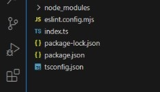

### 1. **Package Overview**
   This package helps skip the process of routine-based boilerplate configuration for a typescript based production ready project.
   By simply running a terminal command your project is scaffolded with the necessary production ready configurations.

### 2. **Installation**
   To install the package all you need do is run the command:
   ```sh 
   npm install typescript-prod-starter --global
   ```
   For this installation to work you must have node >= 20 installed. Install [here](https://nodejs.org/en)

### 3. **Usage Instructions**
NOTE: This package can only be used for a new project.

   #### Initialize your project
   ```sh
   npm init -y
   ```
   #### Scaffolding your project
   - To scaffold your project run the command
   ```sh
   typescript-prod-starter init
   ```

### 4. **Features**
   - a tsconfig.json file is created for you, with the following compiler options:
   ```json
   {
  "compilerOptions": {
    "target": "ES6",
    "outDir": "./build/",
    "module": "commonjs",
    "strict": true,
    "noUnusedLocals": true,
    "noUnusedParameters": true,
    "noImplicitReturns": true,
    "noFallthroughCasesInSwitch": true,
    "esModuleInterop": true,
    "resolveJsonModule": true
  }
  }
   ```
   - a test index.ts file is created.

   - already configured eslint plugins:
   ```js
   import eslint from '@eslint/js';
import tseslint from 'typescript-eslint';
import stylistic from "@stylistic/eslint-plugin";

export default tseslint.config({
    files: ['**/*.ts'],
    extends: [
        eslint.configs.recommended,
        ...tseslint.configs.recommendedTypeChecked,
    ],
    languageOptions: {
        parserOptions: {
            project: true,
            tsconfigRootDir: import.meta.dirname,
        },
    },
    plugins: {
        "@stylistic": stylistic,
    },
    ignores: ["build/*"],
    rules: {
        '@stylistic/semi': 'error',
        '@typescript-eslint/no-unsafe-assignment': 'error',
        '@typescript-eslint/no-explicit-any': 'error',
        '@typescript-eslint/explicit-function-return-type': 'off',
        '@typescript-eslint/explicit-module-boundary-types': 'off',
        '@typescript-eslint/restrict-template-expressions': 'off',
        '@typescript-eslint/restrict-plus-operands': 'off',
        '@typescript-eslint/no-unused-vars': [
            'error',
            { 'argsIgnorePattern': '^_' }
        ],
    },
});
   ```

   - the following libraries are installed:
   ```json
    "devDependencies": {
    "@eslint/js": "^9.18.0",
    "@stylistic/eslint-plugin": "^2.13.0",
    "@types/eslint__js": "^8.42.3",
    "eslint": "^9.18.0",
    "typescript": "^5.7.3",
    "typescript-eslint": "^8.21.0"
  }
   ```
 - the following scripts are added to your package.json file:
 ```json
  "scripts": {
    "tsc": "tsc",
    "lint": "eslint ."
  }
 ```
   

### 5. **Examples**
   - the folder structure resembles this:

   - 

### 9. **License**
   - MIT
